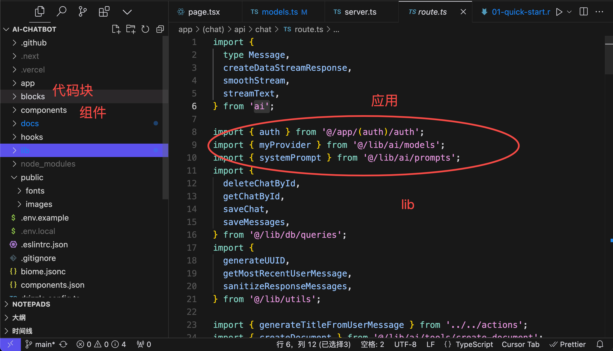

# playground


## 学习ai-chatbot

[https://github.com/vercel/ai-chatbot](https://github.com/vercel/ai-chatbot是一个非常好的易于学习的Node.js)

是一个非常好的易于学习的Node.js AI Agent开发项目模版。

- 1、基于next，ai-sdk，实现基于openai模型的chatbot功能，技术栈和功能很实用。
- 2、足够小，100个ts文件，代码行数10000行左右，结构清晰，简单易学。
- 3、前后端，典型的全栈应用，包含postgre db，鉴权，react，ai，非常全面了。很多最佳实践，比如toast库，密码加盐处理等。
- 4、可以使用aihubmix等openai代理服务，支持支付宝。
- 5、扩展性强，使用其他模型，以及langchain、llamaindex等。

部署还是有点麻烦，涉及的内容还是比较多的。


本地部署

- 参考文档
- 创建postgres，使用vercel的在线的serverless版postgres。
- 执行本地db初始化和迁移

执行pnpm dev启动，注册用户，然后就可以成功访问了。但大模型用不了

大家都知道openai在国内的情况，

这里采用[aihubmix](https://doc.aihubmix.com/coding/%E5%9C%A8%E5%AE%98%E6%96%B9%20openai%20%E5%BA%93%E4%B8%AD%E4%BD%BF%E7%94%A8)，支付宝付费，基本够用，充个1刀或5刀。


原@ai-sdk/openai里的openai方法，没有baseURL的。

```
import { openai } from '@ai-sdk/openai';
```

略改造。

```
import { createOpenAI } from '@ai-sdk/openai';

const openai = createOpenAI({
  // custom settings, e.g.
  compatibility: "strict", // strict mode, enable when using the OpenAI API
  apiKey: process.env.OPENAI_API_KEY,
  baseURL: process.env.OPENAI_BASE_URL,
});
```

执行pnpm dev启动，此时就是一个完全的

](imgs/20250212092116.png)

### 0、基础

需要掌握nextjs、react、ts、vercel平台部署。

这里面的我没有写，需要大家自己查阅，下面是我看到的一些比较好的小的最佳实践

### 1、组件

应该是最好的toast了

```
import { Toaster } from 'sonner';
```

@radix-ui是个很好的ui库，radix-ui 是逻辑，shadcn 是 UI。基本组件 radix-ui，表格 tanstack-table，表单 react-form-hooks，然后加上 shadcn/ui 的皮.

感谢：https://github.com/i5ting/node-ai-playground/issues/1

### 2、db操作

基于drizzle操作db，这个选型也是极好的，基本上prisma和drizzle这2个最佳选择了

### 3、npm run db:migrate

里面有migrate，熟悉rails的都清楚，建表，做数据清洗都是极好的。
参考npm run db:migrate

### 4、选用serverless版本的postgre：neon

这也算最佳实践。

https://console.neon.tech/

这个唯一麻烦的是节点都在国外，如果是出海应用，极好。否则rt可能会超过1s。

### 5、用户密码加盐

```
export async function createUser(email: string, password: string) {
  const salt = genSaltSync(10);
  const hash = hashSync(password, salt);

  try {
    return await db.insert(user).values({ email, password: hash });
  } catch (error) {
    console.error('Failed to create user in database');
    throw error;
  }
}
```

### 6、目录结构合理



### 7、react组件抽象度适中

比如AuthForm，

```
export function AuthForm({
  action,
  children,
  defaultEmail = '',
}: {
  action: NonNullable<
    string | ((formData: FormData) => void | Promise<void>) | undefined
  >;
  children: React.ReactNode;
  defaultEmail?: string;
}) {
  ...
}
```

用法，注册和登录都可以复用

```
<AuthForm action={handleSubmit} defaultEmail={email}>
```

### 8、css

基于tailwindcss和postcss，写法很舒服，ai出码也很方便，就容易写脏。算最佳时间，如果有unocss就更好了。

### 9、http 请求用的swr

支持cache的http client。很实用，很好的库

### 10、ai-sdk用法

可圈可点

```
export const myProvider = customProvider({
  languageModels: {
    "chat-model-small": openai("gpt-4o-mini"),
    "chat-model-large": openai("gpt-4o"),
    "chat-model-reasoning": wrapLanguageModel({
      model: fireworks("accounts/fireworks/models/deepseek-r1"),
      middleware: extractReasoningMiddleware({ tagName: "think" }),
    }),
    "title-model": openai("gpt-4-turbo"),
    "block-model": openai("gpt-4o-mini"),
  },
  imageModels: {
    "small-model": openai.image("dall-e-2"),
    "large-model": openai.image("dall-e-3"),
  },
});
```


### 高级玩法

参考https://chatkit.app/，功能界面都差不多，自己参考这个产品功能去实现，也是个不错的学习方式。

## 学习ai搜索

前几天发的ai-chatbot大火，今天分享一个ai搜索，这个开源项目也很简单，非常适合入门。如果已经熟悉了ai-sdk，这里再学一些搜索服务继承，也是极好的。

https://github.com/zaidmukaddam/scira


## 从LlamaIndexTs学习


## 更好的client

https://github.com/block/goose

## other


### 在md里粘贴图片

安装https://marketplace.visualstudio.com/items?itemName=telesoho.vscode-markdown-paste-image扩展，用于在md里粘贴图片

快捷键alt + cmd + v。

